Micro servo modification (MG90S or SG90)
--------

### Part list

* 1 x MG90S servo
* 1 x Adafruit ItsyBitsy M0 Express
  * https://learn.adafruit.com/introducing-itsy-bitsy-m0
* 1 x SparkFun Motor Driver - Dual TB6612FNG (1A)
  * https://www.sparkfun.com/products/14451
* 2 x ITR8307
* 2 x 120 ohm resistor
* 1 x 6.8 kohm resistor
* 1 x 1.5 kohm resistor

Cad and stl files for 3D printing:
```
CadFiles/MicroServo
```

Electrical schematic:
```
PcbDesignes/MicroServo
```

### Build instructions

| 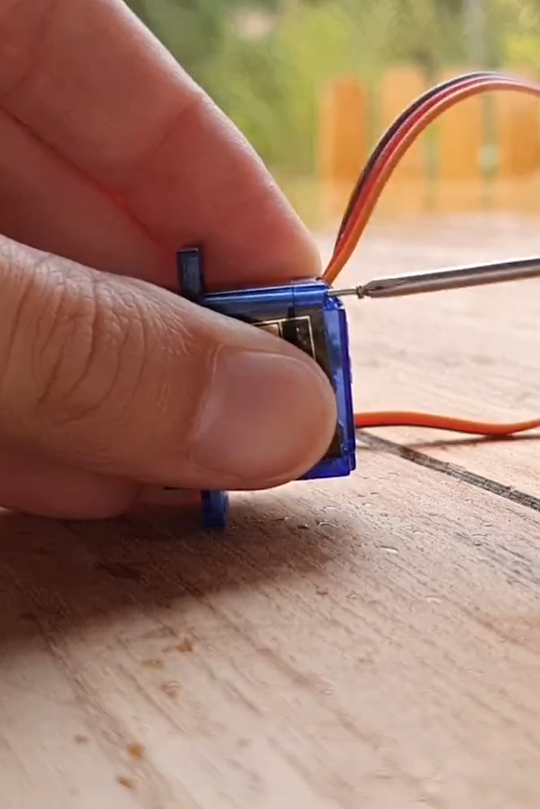 |  | 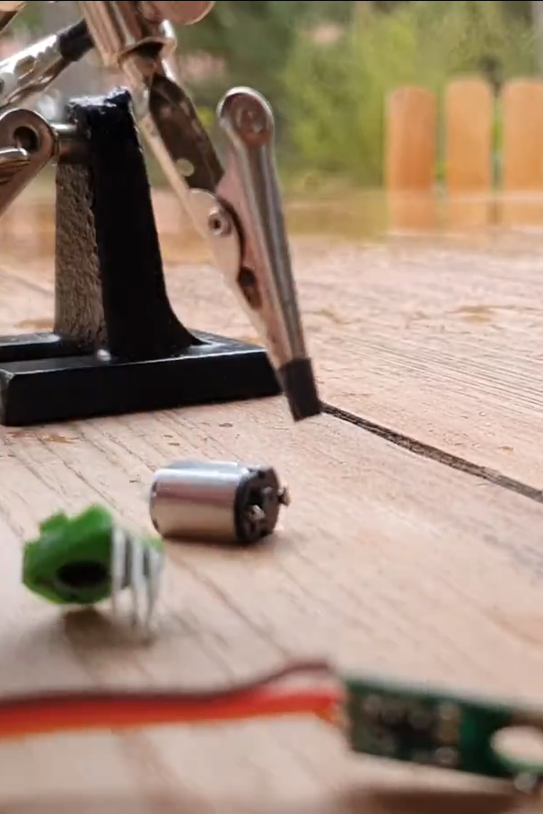 |
| :-- | :-- | :-- |

1) Open the servo, desolder the motor and the potentiometer

|  |  |  |
| --- | --- | --- |

2) Bend down the motor terminals and remove the plastic back axis cover so the motor looks like the one in the last image

| 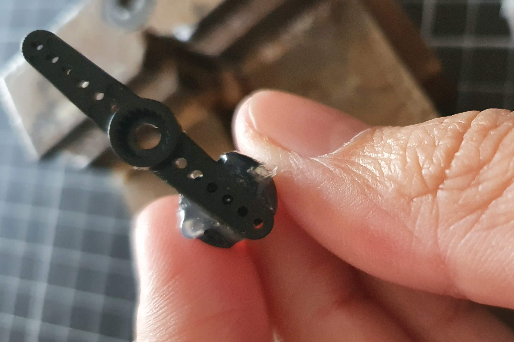 | 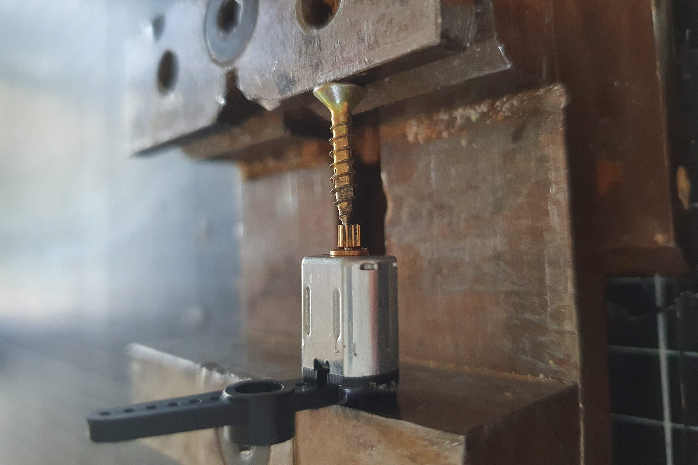 |  |
| --- | --- | --- |

3) Place one of the holes on a servo horn over the axis. Then use a screw and a vice to push out the motor axis about 1 mm so it looks like the motor in the last image.

|  |  | 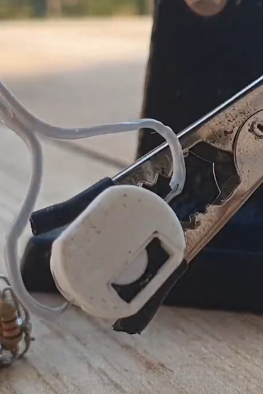 |
| --- | --- | --- |

4) Then solder two wires to the motor terminals. Use super glue to mount the optical encoder wheel to the back axis and mount the 3D printed "OpticalEncoderSensorMount" part over the back of the motor.

|  |  | 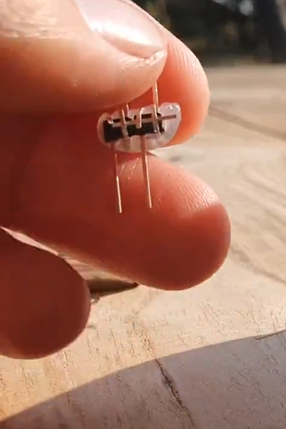 |
| --- | --- | --- |

5) Place the two IR sensors next to each other on a piece of tape and put some hot glue over them. Fold pin 4 of the lower sensor like the middle picture shows. Then fold in the rest of the ground pins, cut them to length and solder them together.

|  | 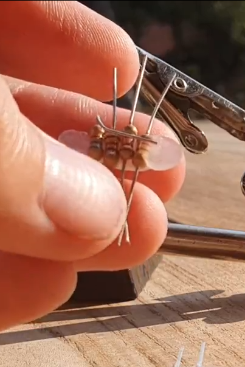 |  |
| --- | --- | --- |

6) Place the four resistors next to each other on a piece of tape, in the order 6.8k, 120, 1.5k and 120 ohm from right to left. Put some hot glue over them to hold them together and remove the tape. Fold the top leg of the 6.8k resistor like the middle picture shows. Then fold in the rest of the 3.3V pins and solder them together.

| 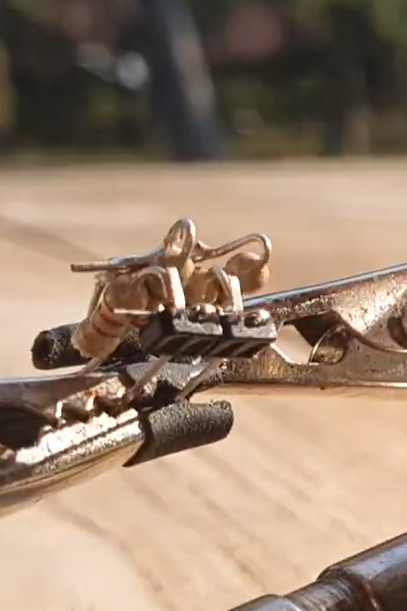 | 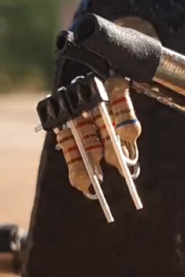 |
| --- | --- |

7) Connect the two 120 ohm resistors to pin 1 on the IR sensors and the 6.8k and 1.5k ohm resistors to pin 3.

| 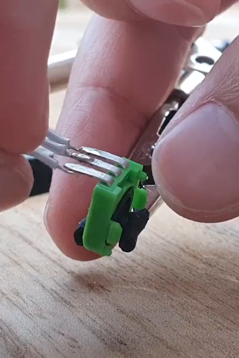 |
| --- |

8) Solder three wires to the potentiometer.

| 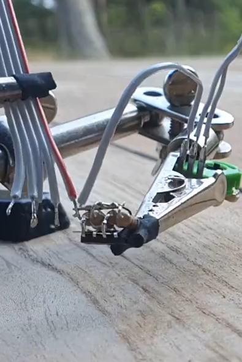 |  |  |
| --- | --- | --- |

9) Connect the potentiometers 3.3V and ground to the optical encoder sensors while soldering on a 5 wire flat cable to the assembly. Then connect the third wire of the flat cable to the potentiometer sens wire and connect the fourth and fifth wires to the IR sensors third pin. This wires up the flat cable so that from right to left we have: 3.3V, GND, output shaft potentiometer, optical encoder channel A and lastly channel B.

|  |  |  |
| --- | --- | --- |

10) Glue the optical encoder sensors to the "OpticalEncoderSensorMount". Cut the screws to a length so that they fit with the servo lid removed.

|  |
| --- |

11) Put back the motor and the potentiometer into the servo. See "PcbDesignes/MicroServo/MainPcb/MainPcb.sch" for info on how to connect the microcontroller and motor driver.