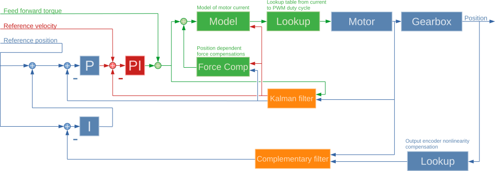

Theory
------

## PID vs Cascade control

The control system of a regular hobby servo looks something like this:

This control scheme is good at holding and moving fast between position, but not so good at following a smooth predefined motion. Which is what you want when you build a robot.

Industrial servo controllers use a cascade based control scheme instead, which looks something like this:

This is the control scheme used in this project.

The main benefit of this approach is that it also takes the velocity and torque into account. This allows for a much tighter motion tracking.

## Backlash control

When dealing with cheap gearboxes, backlash is always a problem. The hacked servos in this project uses two encoders to compensate for backlash. One AS5048a magnetic encoder or a potentiometer on the output shaft and one custom optical encoder inside the DC-motor. The benefit of having the extra encoder inside the motor is getting higher resolution and a main control loop which is backlash free. If one would only use the AS5048a for controlling, the backlash would enter the control loop as a time delay. This limits the control loop performance.

The backlash compensation is done by moving the motor position control loops reference-position so that the output encoder reaches the correct position.

## The complete control loop

The following diagram shows the full control loop design used in this project:

It consists of three cascade control levels:
1) Backlash control loop
2) Motor position control loop
3) Motor velocity control loop

Apart from these three feedback loops there are four model/open-loop based compensation steps based on:
1) Velocity based motor current model (see CurrentControlModel class in `ArduinoSketch/src/Control/CurrentControlLoop.cpp`)
2) PWM duty cycle based motor current model (lookup table based, see `ArduinoSketch/src/Hardware/PwmHandler.cpp`)
3) Motor position based force compensation (see `ArduinoSketch/src/Control/DCServo.cpp` function `applyForceCompensations`)
4) Output encoder nonlinearity model

For the exact implementation see the `controlLoop()` function in `ArduinoSketch/src/Control/DCServo.cpp`.

## System identification

To be able to calculate the parameters of the control loops we need to have a mathematical model of the servo. This is handled by the python module `SystemIdentification.py`. First step is to record the position-time-series of the motor for a sequence of PWM values with random sign. The sequence starts with the highest PWM value, in the test range, and moves down towards the lowest, in discrete steps. Next the velocity is calculated from the position-time-series. For each part, with the same absolute PWM value, the velocity change will follow this equation:

$$ v_{k+1} = a v_k + b u_k - c_f sign(v_k) $$

where $u_k$ is $\pm$ the PWM value and $c_f$ is the friction constant. By only considering the parts where

$$ sign(v_k) = sign(u_k) $$

we can bake in $c_f$ into $b$ resulting in:

$$ v_{k+1} = a v_k + b^{'} u_k $$

The parameters $a$ and $b^{'}$ are then estimated with the least squares method. After that their continuous time equivalent values $a_{cont}$ and $b_{cont}$ are calculated.

How $b_{cont}$ varies over the PWM range is then used to calculate the PWM nonlinearity and the linear trend of $a_{cont}$ is used to calculate the $c_{EMF}$ value of the motor.

After this we add friction to the model and simulate the response. The final friction $c_{fric}$ is calculated by minimizing the error between the model and the real system.

The final model looks like this:

$$ \frac{dv}{dt} = a_{cont} v(t) + b_{cont} pwmNonlin(u(t)) + c_{fric} sign(v(t)) + c_{EMF} abs(pwmNonlin(u(t))) v(t) $$

## Calculating the control parameters
This project uses pole placement to calculate the control parameters for the cascade controllers. To get the equations for the poles we need to find the closed transfer functions for the velocity and position control loops.

### Transfer function of open system to closed system
Given the discrete transfer function for the open system:

$$ G_0(z)=\frac{p(z)}{q(z)} $$

where $p(z)$ and $q(z)$ are pure polynomials, we can derive the closed system's transfer function as follows:

$$ Y = G_0(z) (R - Y) \iff Y = \frac{G_0(z)}{1 + G_0(z)} R = \frac{p(z)}{p(z) + q(z)}R $$

Which gives us the closed system transfer function

$$ G_c(z) = \frac{p(z)}{p(z) + q(z)} $$

### Position control loop

The position control loop's open transfer function consists of a proportional gain controller and an integrator (we approximate the inner velocity loop as a pure integrator):

$$ G_0(z)=G_{posControl}(z) G_{velLoop}(z)= (L_0) (\frac{dt}{z - 1}) $$

This gives us $p(z) = L_0 dt$ and $q(z) = z - 1$ which means that the pole polynomial is:

$$ p(z) + q(z) = z - 1 + L_0 dt $$

with the root:

$$ z - 1 + L_0 dt = 0 \iff z_{posPole} = 1 - L_0 dt $$

which means that the position control loop gain $L_0$ can be calculated with:

$$ L_0 =\frac{1 - z_{posPole}}{dt} $$

### Velocity control loop

The velocity control loop's open transfer function consists of a PI controller and the motor's transfer function (from control signal to velocity) which we approximate as a first order damped system:

$$ G_0(z)=G_{velControl}(z) G_{motor}(z)= (L_1 + L_2 \frac{1}{z - 1})(\frac{b}{z - a}) $$

This gives us $p(z) = b (L_1 (z - 1) + L_2)$ and $q(z) = (z - 1)(z - a)$ which means that the pole polynomial is:

$$ p(z) + q(z) = b (L_1 (z - 1) + L_2) + (z - 1)(z - a) = (a - b L_1 + b L_2) + (b L_1 -a - 1) z + z^2 $$

Substituting in $L_1^{'} = b L_1$ and $L_2^{'} = b L_2$ gives us:

$$ (a - L_1^{'} + L_2^{'}) + (L_1^{'} -a - 1) z + z^2 $$

with the roots:

$$ z_{velPole} = 1/2 (±\sqrt{{L_1^{'}}^2 + (1 - a) ((1 - a) + 2 L_1^{'}) - 4 L_2^{'}} + a - L_1^{'} + 1) $$

Given that we want the closed loop system to be stable and at least as fast as the open loop ($z_{openLoopPole} = a$) we can deduce the following:

$$ 0 < 1/2 (a - L_1^{'} + 1) \le a \le 1  \iff $$

$$ 0 < a - L_1^{'} + 1 \le 2a, \space 0 < a \le 1 \Rightarrow $$

$$ 0 \le 1 - a \le L_1^{'} < a + 1 \le 2 $$

To get a damped system we need real roots $\Rightarrow$

$$ {L_1^{'}}^2 + (1 - a) ((1 - a) + 2 L_1^{'}) - 4 L_2^{'} \ge 0 $$

since $0 < a \le 1$ and $L_1^{'} > 0 \Rightarrow$

$$ {L_1^{'}}^2 + (1 - a) ((1 - a) + 2 L_1^{'}) - 4 L_2^{'} \ge 
 {L_1^{'}}^2 - 4 L_2^{'} \ge 0 $$

Substituting back to $L_1$ and $L_2$ results in:

$$ b (b L_1^2 - 4 b L_2) \ge 0 \iff b L_1^2 \ge 4 L_2 $$

If $L_1$ and $L_2$ are calculated so that

$$ {L_1^{'}}^2 - 4 L_2^{'} = 0 $$

then an increase of the load inertial on the motor ($b^{'} < b$) will result in an undamped system. To prevent this we can introduce an inertial margin $c_{im}$ such that $b^{'} = b / c_{im} \le b$. We want the damped system inequality to hit the limit if $b$ changes to $b^{'}$. This yields the following:

$$ (a - 1)^2 - 2 a L_1^{'} / c_{im} + (L_1^{'} / c_{im})^2 + 2 L_1^{'} / c_{im} - 4 L_2^{'} / c_{im} = 0 \iff $$

$$ L_2^{'} = 1/4 (c_{im} (a - 1)^2 - 2 a L_1^{'} + {L_1^{'}}^2 / c_{im} + 2 L_1^{'}) = $$

$$ = L_2^{'} = 1/4 ({L_1^{'}}^2 / c_{im} + (a - 1) (c_{im} (a - 1) - 2 L_1^{'})) $$

The slowest pole of a system is the one that affect the speed of the system the most and a discrete pole is slower the closer to the value one it is. Since both of the velocity poles should satisfy

$$ 0 < z_{velPole} \le a $$

we should place the largest pole of the two:

$$ z_{velPole} = 1/2 (\sqrt{{L_1^{'}}^2 + (1 - a) ((1 - a) + 2 L_1^{'}) - 4 L_2^{'}} + a - L_1^{'} + 1) $$

substituting in $L_2^{'}$

$$ z_{velPole} = 1/2 (\sqrt{{L_1^{'}}^2 + (1 - a) ((1 - a) + 2 L_1^{'}) - {L_1^{'}}^2 / c_{im} - (1 - a) (c_{im} (1 - a) + 2 L_1^{'})} + a - L_1^{'} + 1) = $$

$$ = z_{velPole} = 1/2 (\sqrt{(1 - 1 / c_{im}) {L_1^{'}}^2 + (1 - a) ((1 - a) + 2 L_1^{'} - c_{im} (1 - a) - 2 L_1^{'})} + a - L_1^{'} + 1) = $$

$$ = z_{velPole} = 1/2 (\sqrt{(1 - 1 / c_{im}) {L_1^{'}}^2 + (1 - a)^2 (1- c_{im})} + a - L_1^{'} + 1) \Rightarrow $$

$$ L_1^{'} = c_{im} (a - 2 z_{velPole} + 1) + 2 \sqrt{c_{im} (c_{im} - 1) (1 - z_{velPole}) (a - z_{velPole})} $$

Resulting in the final equations:

$$ L_1^{'} = c_{im} (a - 2 z_{velPole} + 1) + 2 \sqrt{c_{im} (c_{im} - 1) (1 - z_{velPole}) (a - z_{velPole})} $$

$$ L_2^{'} = 1/4 ({L_1^{'}}^2 / c_{im} + (a - 1) (c_{im} (a - 1) - 2 L_1^{'})) $$

$$ L_1 = L_1^{'} / b $$

$$ L_2 = L_2^{'} / b $$
