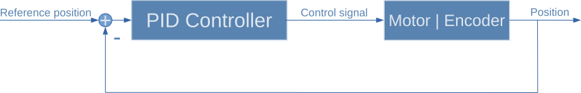
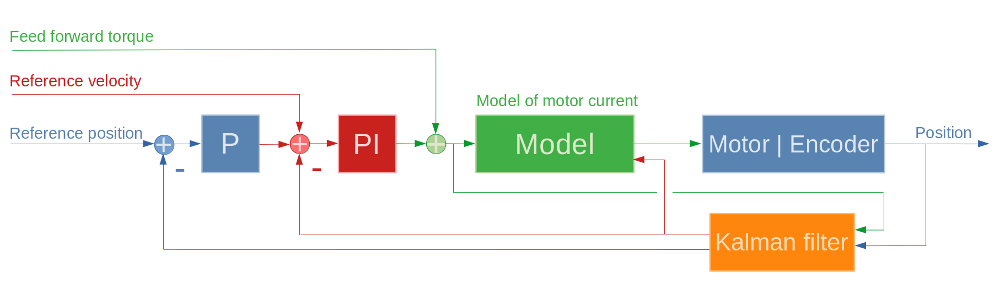

Theory
------

### PID vs Cascade control

The control system of a regular hobby servo looks something like this:

This control scheme is good at holding and moving fast between position, but not so good at following a smooth predefined motion. Which is what you want when you build a robot.

Industrial servo controllers use a cascade based control scheme instead, which looks something like this:

This is the control scheme used in this project.

The main benefit of this approach is that it also takes the velocity and torque into account. This allows for a much tighter motion tracking.

### Backlash control

When dealing with cheap gearboxes, backlash is always a problem. The hacked servos in this project uses two encoders to compensate for backlash. One AS5048a magnetic encoder or a potentiometer on the output shaft and one custom optical encoder inside the DC-motor. The benefit of having the extra encoder inside the motor is getting higher resolution and a main control loop which is backlash free. If one would only use the AS5048a for controlling, the backlash would enter the control loop as a time delay. This limits the control loop performance.

The backlash compensation is done by moving the main control loops reference-position so that the output encoder reaches the correct position.
