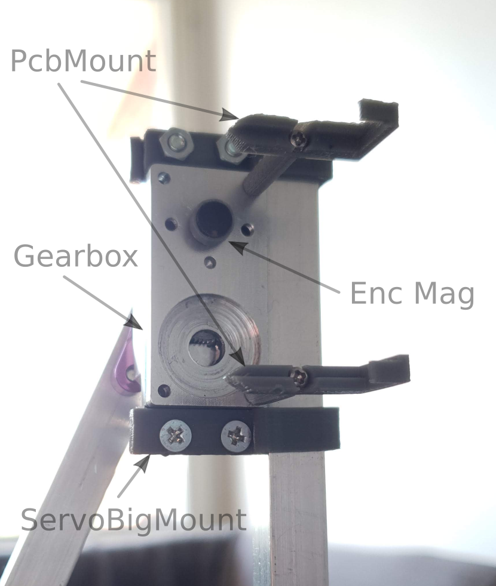
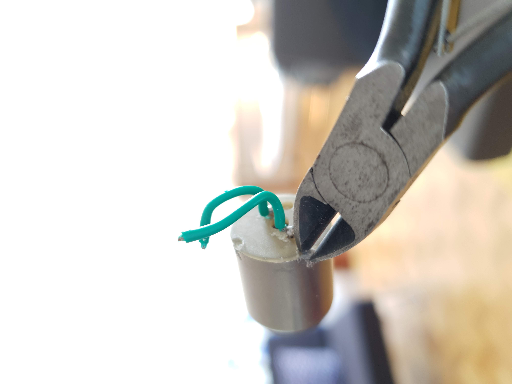
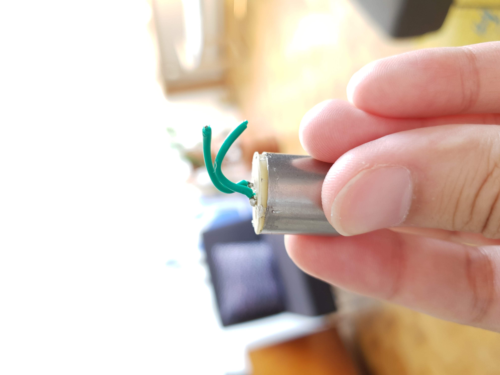
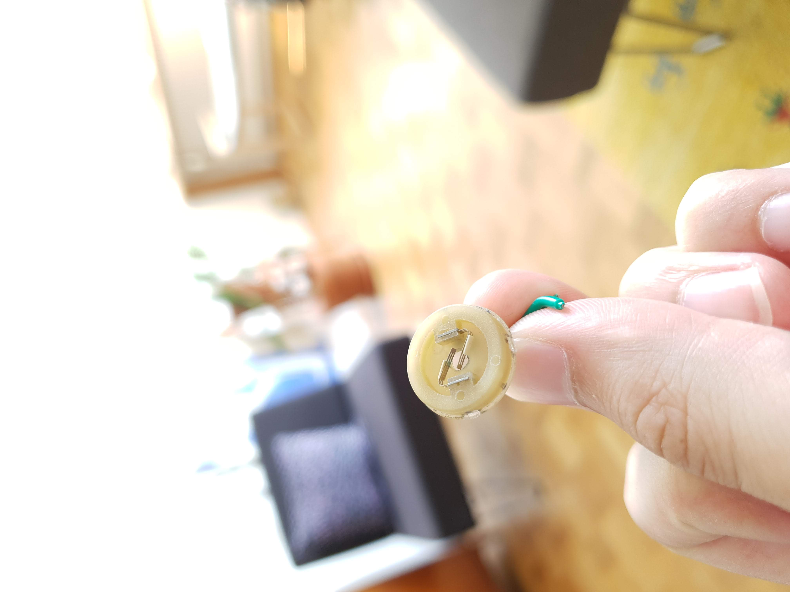
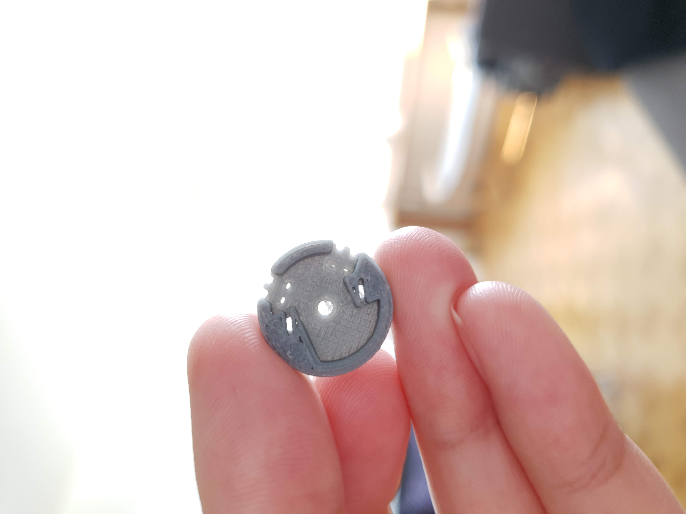
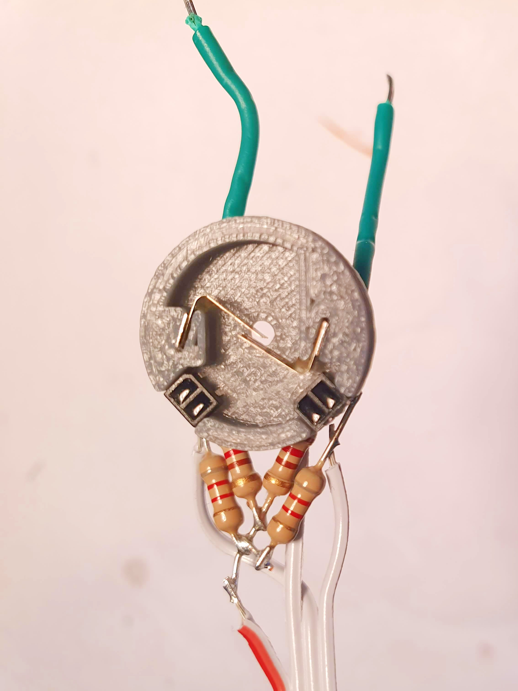
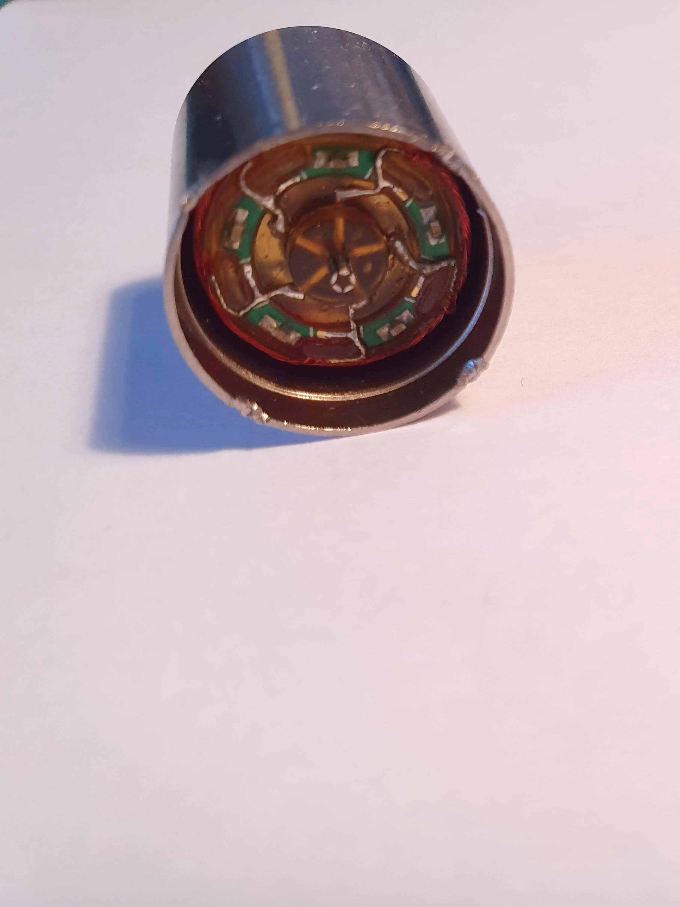

# ServoProject


#### Getting the most out of your hobby servo

Theory
------

The control system of a regular hobby servo looks something like this:


This control scheme is good at holding and moving fast between position, but not so good at following a smooth predefined motion. Which is what you want when you build a robot.

Industrial servo controllers uses a cascade based control scheme insted, which looks something more like this:


This is the control scheme used in this project.

The main benefit of this approach is that it also takes the velocity and torque into account. This allows for a much tighter motion tracking.

### Backlash control

When dealing with cheap gearboxes, backlash is always a problem. The hacked servos in this project uses two encoders to compensate for backlash. One AS5048a magnetic encoder on the output shaft and one custom optical encoder inside the DC-motor. The benefit of having the extra encoder inside the motor is getting higher resolution and a main control loop which is backlash free. If one would only use the AS5048a for controlling, the backlash would enter the control loop as a time delay. This limits the control loop performance.

The backlash compensation is done by moving the main control loops reference-position so that the output encoder reaches the correct position.

Project structure
----------------

### ArduinoSketch

Holds the the Arduino project for the Adafruit ItsyBitsy M0 Express boards.

When compiling, the active configuration is selected by modifying the `#include "*.h"` line in the `config/config.h` file to include the desired config file. The `configSelector.py` script can be used to to simplify the config selecting process by giving a dropdown list with all configs in the config folder.

The folder also holds a Makefile which can be used to compile and transfer the project. One benefit of using the make file is that the configSelector script always is executed prior to compiling. To be able to use the Makefile you most first install arduino-cli.

There are three configurations in the config folder:

* `servoNr1.h`

* `servoNr2.h`

* `servoNr3.h`

These need to be updated to mach you hardware. The instructions of how to do this is written in each config file.

### MasterCommunication

Holds the example master project.

To compile run `make`. This creates the program `./executable` with the following options.

```
Allowed options:
  --servoNr arg         servo nr
  --recOpticalEncoder   recorde optical encoder data of given servo
  --recSystemIdentData  recorde system ident data of given servo
  --recMomentOfInertia  recorde moment of inertia data of given servo
  --playPath            play the path defined in createPath()
  --output arg          data output file
  --simulate            simulate servos
```

#### MasterCommunication/systemIdent.py
Script used for updating the servo configs and has the following options.

```
optional arguments:
  -h, --help            show this help message and exit
  --opticalEncoderDataFile [OPTICALENCODERDATAFILE]
                        optical encoder data file to load
  --systemIdentDataFile [SYSTEMIDENTDATAFILE]
                        system identification data file to load
  -p PLOTDATA, --plotData PLOTDATA
                        plot the recorded data (default is False)

```

#### MasterCommunication/view.kst
Kst2 project file which can be used to view the recorder data in `test.txt` from `--playPath` option.
Run 
```
./executable --playPath --output test.txt
```
to start robot movement and update plots.

### USB_To_Serial

Basic Arduino project to turn an arm based Arduino into a fast usb-to-serial-converter. The resulting communication delay becomes much lower than FTDI based converters. This is important since the master has to be able to send and receive from all six communication slaves every 12 ms. 

### CadFiles

Holds all `.stl` and the original Freecad files

### PcbDesignes

Holds KiCad projects for all PCBs

Dependencies
------------

#### ArduinoSketch
* Adafruit_DotStar `source:` Arduino Library List
* LinkedList `source:` Arduino Library List
* EigenArduino `source:` https://github.com/vancegroup/EigenArduino.git
* AdcHandler `source:` https://github.com/adamb314/adchandler
* ThreadHandler `source:` https://github.com/adamb314/threadhandler

#### ArduinoSketch/configSelector.py
* Python >= 3.8.2
* python3-gi

#### ArduinoSketch/Makefile
* GNU Make >= 4.2.1
* arduino-cli

#### MasterCommunication/Makefile
* GNU Make >= 4.2.1
* boost >= 1.71.0
* Eigen >= 3.4.0

#### MasterCommunication/systemIdent.py
* Python >= 3.8.2
  * numpy >= 1.18.5
  * scipy >= 1.5.0
  * matplotlib >= 3.2.1

Hardware
--------

### Parts list

* 3 x Turnigy MG959 servo
* 3 x SG90 servo
* 3 x Adafruit ItsyBitsy M0 Express
  * https://learn.adafruit.com/introducing-itsy-bitsy-m0
* 3 x SparkFun Motor Driver - Dual TB6612FNG (1A)
  * https://www.sparkfun.com/products/14451
* 3 x ACS711EX Current Sensor (optional)
  * https://www.pololu.com/product/2452
* 3 x as5048A + 6mm x 2mm comopatible magnet
  * https://ams.com/as5048a
* 6 x ITR8307
* 6 x 120 ohm resistor
* 6 x 8.2 kohm resistor
* 1 x 5V Powersuply 
* 1 x Arduino MKR Zero
  * https://store.arduino.cc/arduino-mkr-zero-i2s-bus-sd-for-sound-music-digital-audio-data

### Servo gearbox with 3D prited parts



### PCB Assemblies


#### How to mount PCBs to servo


### Build MainPcb and AS5048aEncoderBoard

A video of how to build the MainPcb and AS5048aEncoderBoard can be found at https://youtu.be/YQpAAr5RPSE?t=60.
This video is for an older version but the building instructions are the same.

### Build the Optical Encoder


1) Take the motor



2) And use a plier to bend out the four indents in the metal housing



3) Bend up the motor lid



4) Remove the two steel brushes from the lid carefully by cutting the lid into pieces



5) Take the 3D prited motor lid



6) Insert the two steel brushes and two ITR8307 into the new lid. Solder the ITR8307 according to 
```
PcbDesignes/Servo/OpticalEncoder/OpticalEncoder.sch
```



7) Take the motor with the lid removed


8) Paint the rotor with black nail polish and glue in a white paper disc on top as shown in the image. The disc has to be glude of center for the encoder to work


9) Carefully put the new lid on the motor without bending the steel brushes


10) Solder the four leads from the encoder on top of ItsyBitsy board as shown

## License
Open Source License

ServoProject is free software. You can redistribute it and/or modify it under the terms of Creative Commons Attribution 3.0 United States License.

To view a copy of this license, visit
http://creativecommons.org/licenses/by/3.0/us/
