# ServoProject
by Adam Bäckström
### Getting the most out of your hobby servo


Theory
------

The control system of a regular hobby servo looks something like this:

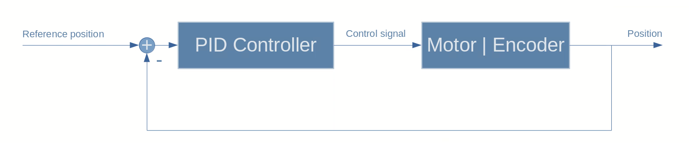

This control scheme is good at holding and moving fast between position, but not so good at following a smooth predefined motion. Which is what you want when you build a robot.

Industrial servo controllers use a cascade based control scheme instead, which looks something like this:

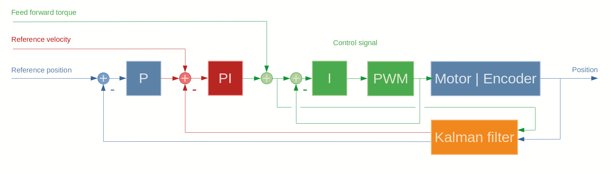

This is the control scheme used in this project.

The main benefit of this approach is that it also takes the velocity and torque into account. This allows for a much tighter motion tracking.

### Backlash control

When dealing with cheap gearboxes, backlash is always a problem. The hacked servos in this project uses two encoders to compensate for backlash. One AS5048a magnetic encoder or a potentiometer on the output shaft and one custom optical encoder inside the DC-motor. The benefit of having the extra encoder inside the motor is getting higher resolution and a main control loop which is backlash free. If one would only use the AS5048a for controlling, the backlash would enter the control loop as a time delay. This limits the control loop performance.

The backlash compensation is done by moving the main control loops reference-position so that the output encoder reaches the correct position.

Project structure
----------------

### ArduinoSketch

This folder contains the Arduino project for the Adafruit ItsyBitsy M0 Express boards.

When compiling, the active configuration is selected by modifying the `#include "*.h"` line in the `config/config.h` file to include the desired config file. The `configSelector.py` and the `configurationWizard.py` scripts can be used to to simplify the config selecting process by giving a drop-down list with all configs in the config folder.

The folder also holds a Makefile which can be used to compile and transfer the project. One benefit of using the Makefile is that the configSelector script always is executed prior to compiling. To be able to use the Makefile you must first install arduino-cli.

#### Setup

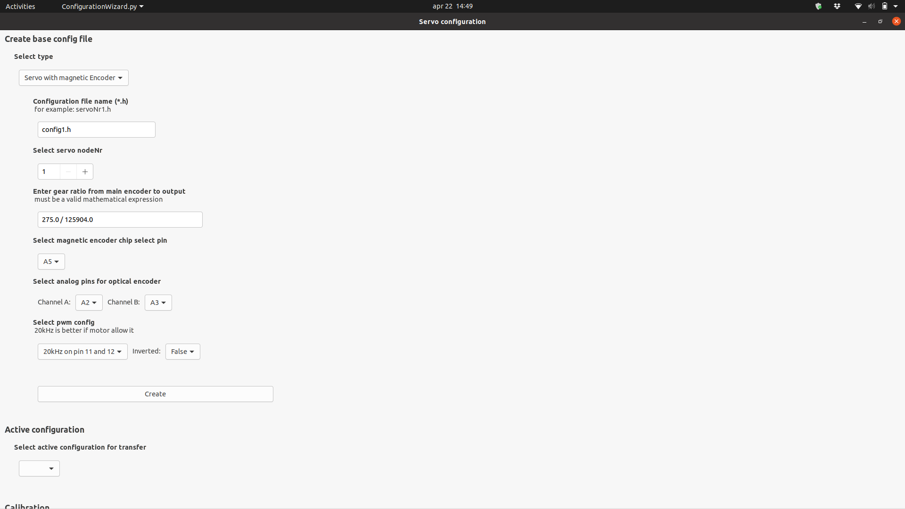

1) Create the base configuration

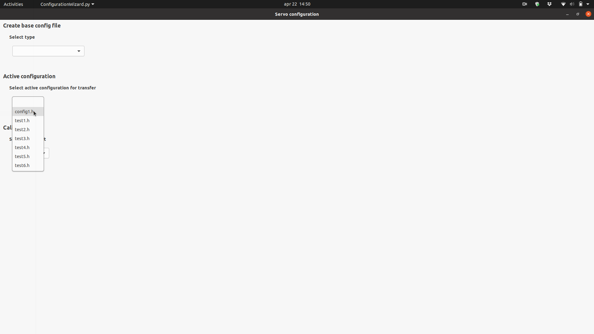

2) Make the new configuration the active configuration by selecting it in the drop-down and transfer the project to the microcontroller. Either with the Arduino IDE or the make script.

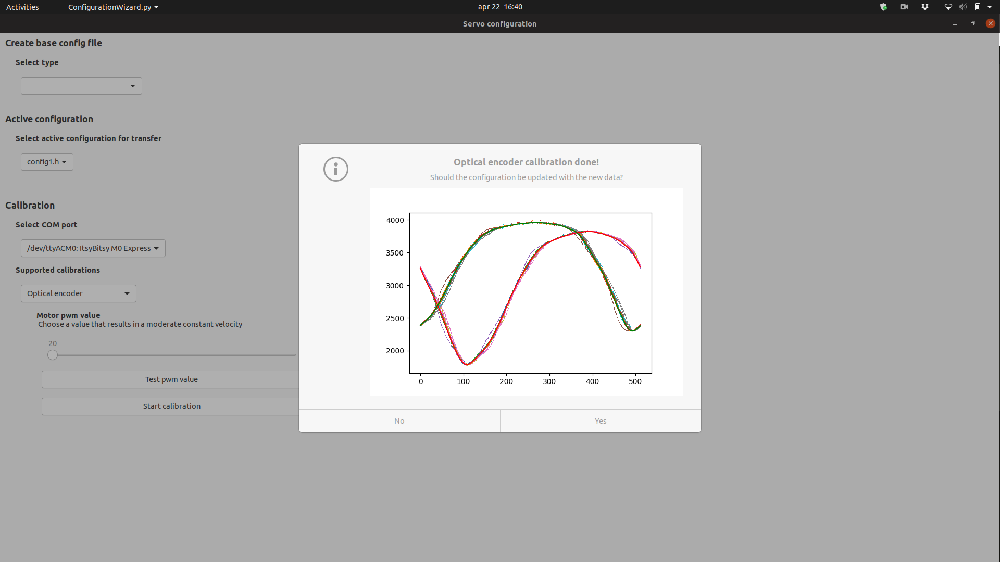

3) Calibrate the optical encoder


4) Calibrate the pwm nonlinearity compensation


5) Generate the system model (auto tune control loops)


6) Calibrate the output encoder nonlinearity compensation

### MasterCommunication

Holds the example master project.

To compile run `make`. This creates the program `./executable` with the following options.

```
Allowed options:
  --playPath            play the path defined in createPath()
  --output arg          data output file
  --simulate            simulate servos

Obsolete options:
  --servoNr arg         servo nr
  --recOpticalEncoder   record optical encoder data of given servo
  --recSystemIdentData  record system ident data of given servo
  --recMomentOfInertia  record moment of inertia data of given servo
  --amp                 amplitude for recMomentOfInertia
  --frq                 frequency for recMomentOfInertia
  --pwmAmp              pwm amplitude for recOpticalEncoder and recSystemIdentData
  --fricPwmAmp          pwm amplitude to overcome friction for recSystemIdentData
```

#### MasterCommunication/view.kst
Kst2 project file which can be used to view the recorder data in `test.txt` from `--playPath` option.
Run 
```
./executable --playPath --output test.txt
```
to start robot movement and update plots.

### USB_To_Serial

Basic Arduino project to turn an arm based Arduino into a fast usb-to-serial-converter. The resulting communication delay becomes much lower than FTDI based converters. This is important since the master has to be able to send and receive from all six servos every 18 ms. 

### CadFiles

Holds all `.stl` and the original Freecad files

### PcbDesignes

Holds all KiCad projects for the electronics

Dependencies
------------

#### ArduinoSketch
* Adafruit_DotStar `source:` Arduino Library List
* LinkedList `source:` Arduino Library List
* EigenArduino `source:` https://github.com/vancegroup/EigenArduino.git
* ThreadHandler `source:` https://github.com/adamb314/threadhandler

#### ArduinoSketch/configSelector.py
* Python >= 3.8.2
* python3-gi

#### ArduinoSketch/configurationWizard.py
* Python >= 3.8.2
* matplotlib >= 3.2.1
* numba
* numpy >= 1.18.5
* python3-gi
* scipy >= 1.5.0
* serial

#### ArduinoSketch/Makefile
* GNU Make >= 4.2.1
* arduino-cli

#### MasterCommunication/Makefile
* GNU Make >= 4.2.1
* gcc >= 9.3.0
* boost >= 1.71.0
* Eigen >= 3.4.0

Hardware
--------

### Parts list

#### Modified normal size servo
* 1 x Turnigy MG959 servo
* 1 x Adafruit ItsyBitsy M0 Express
  * https://learn.adafruit.com/introducing-itsy-bitsy-m0
* 1 x SparkFun Motor Driver - Dual TB6612FNG (1A)
  * https://www.sparkfun.com/products/14451
* 1 x as5048A + 6mm x 2mm comopatible magnet
  * https://ams.com/as5048a
* 2 x ITR8307
* 2 x 8.2 kohm resistor
* 2 x 120 ohm resistor

Cad and stl files for 3D printing:
```
CadFiles/Servo
```

Electrical schematic:
```
PcbDesignes/Servo
```

#### Modified micro servo
* 1 x MG90S servo
* 1 x Adafruit ItsyBitsy M0 Express
  * https://learn.adafruit.com/introducing-itsy-bitsy-m0
* 1 x SparkFun Motor Driver - Dual TB6612FNG (1A)
  * https://www.sparkfun.com/products/14451
* 2 x ITR8307
* 2 x 120 ohm resistor
* 1 x 6.8 kohm resistor
* 1 x 1.5 kohm resistor

Cad and stl files for 3D printing:
```
CadFiles/MicroServo
```

Electrical schematic:
```
PcbDesignes/MicroServo
```

#### Gripper
* 1 x SG90 servo

".stl" files for 3D printing:
```
CadFiles/Robot/stl/GripperBase.stl
CadFiles/Robot/stl/GripperClip.stl
CadFiles/Robot/stl/GripperFinger1.stl
CadFiles/Robot/stl/GripperFinger2.stl
CadFiles/Robot/stl/GripperMount.stl
```

#### Robot
* 3 x Modified normal size servo
* 3 x Modified micro servo
* 1 x Gripper
* 1 x 10 x 10 mm square aluminum bar (about 500 mm)
* 1 x 15 x 15 mm square aluminum bar (about 100 mm)
* 1 x 5V Powersuply 
* 1 x Fast USB to serial microcontroller (Adafruit ItsyBitsy M0 Express or Arduino MKR Zero)
  * https://learn.adafruit.com/introducing-itsy-bitsy-m0
  * https://store.arduino.cc/arduino-mkr-zero-i2s-bus-sd-for-sound-music-digital-audio-data

Cad and stl files for 3D printing:
```
CadFiles/Robot
```

## Normal size servo modification (Turnigy MG959)

#### Build MainPcb and AS5048aEncoderBoard

A video on how to build the MainPcb and AS5048aEncoderBoard can be found at https://youtu.be/YQpAAr5RPSE?t=60.
This video is for an older version but the building instructions are the same.

#### Servo gearbox with 3D printed parts

|  | 
| --- |

#### PCB Assemblies

|  | 
| --- |

#### How to mount the PCBs to servo

|  |  |
| --- | --- |

|  | 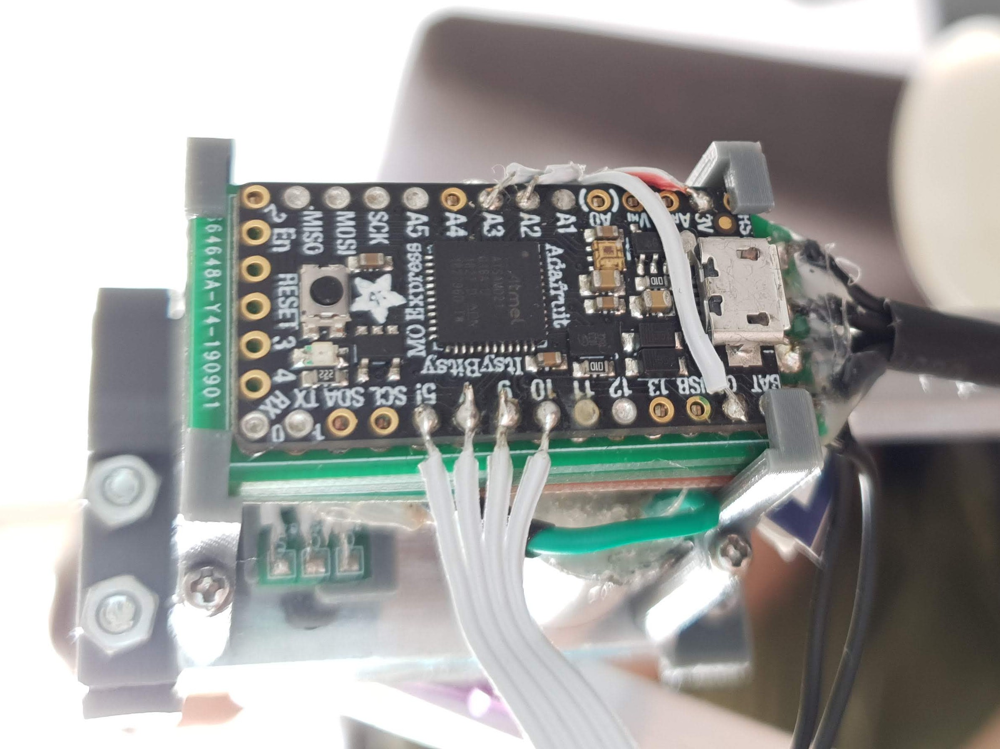 |
| --- | --- |

#### Build the Optical Encoder

|  |  |  |
| --- | --- | --- |

1) Take the motor, use pliers to bend out the four indents in the metal housing and bend up the motor lid.

|  |  |  |
| --- | --- | --- |

2) Remove the two steel brushes from the lid carefully by cutting the lid into pieces. Take the 3D printed motor lid and insert the two steel brushes and two ITR8307 into the new lid. Solder the ITR8307 according to:
```
PcbDesignes/Servo/OpticalEncoder/OpticalEncoder.sch
```

|  |  | 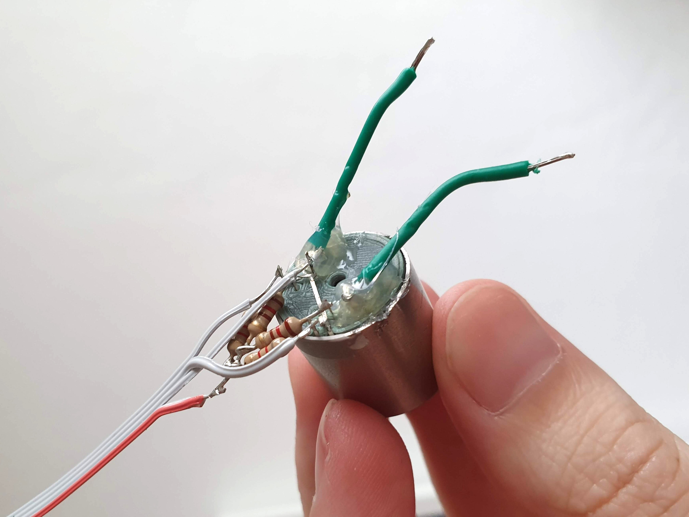 |
| --- | --- | --- |

3) Take the motor with the lid removed. Paint the rotor with black nail polish and glue in the optical encoder wheel on top as shown in the middle image. The dimensions of the encoder wheel can be found in:
```
CadFiles/Servo/OpticalEncoderWheelDimensions.png

```
Then carefully put the new lid on the motor without bending the steel brushes.

|  | 
| --- |

4) Solder the four leads from the optical encoder on top of ItsyBitsy board as shown in this image.

## Micro servo modification (MG90S or SG90)

|  |  |  |
| :-- | :-- | :-- |

1) Open the servo, desolder the motor and the potentiometer

| 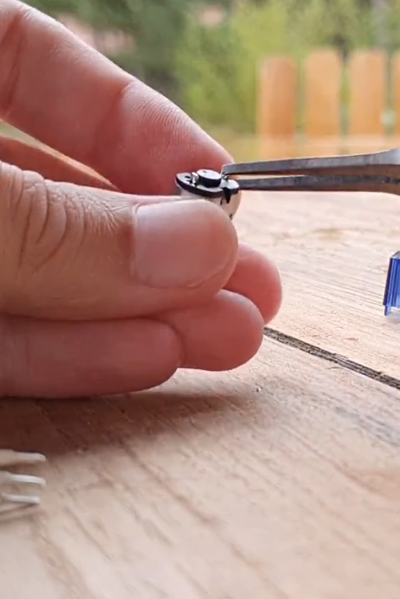 |  | 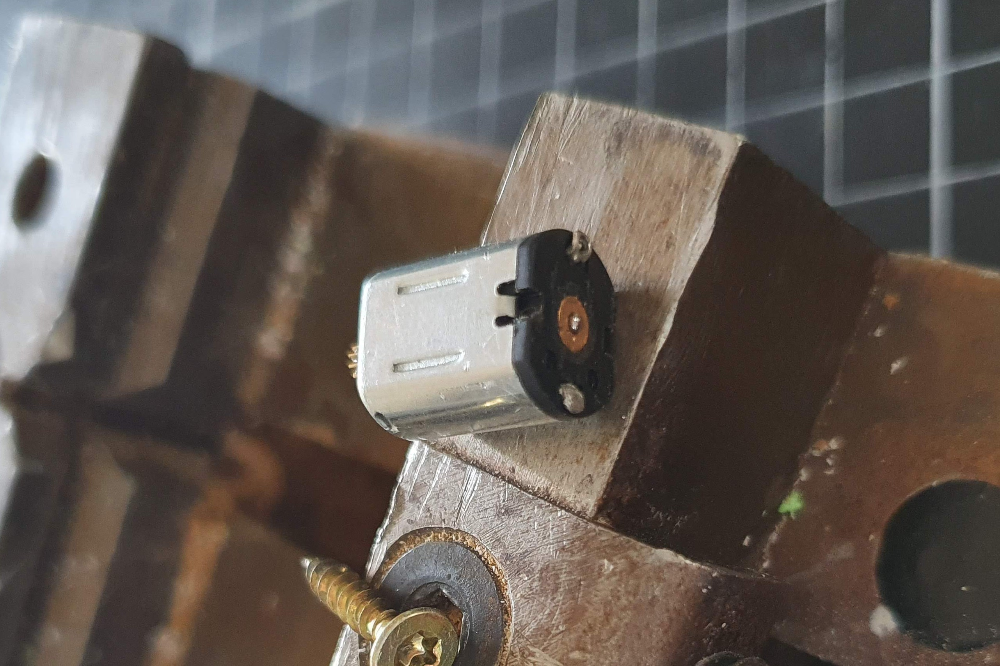 |
| --- | --- | --- |

2) Bend down the motor terminals and remove the plastic back axis cover so the motor looks like the one in the last image

| 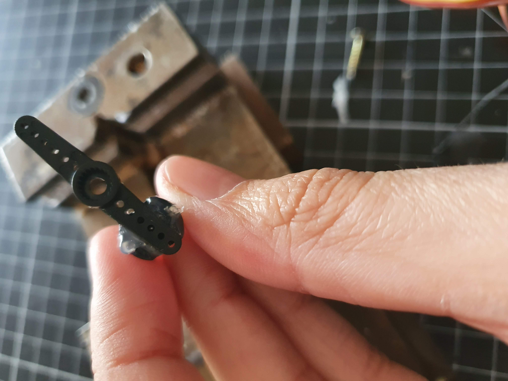 |  | 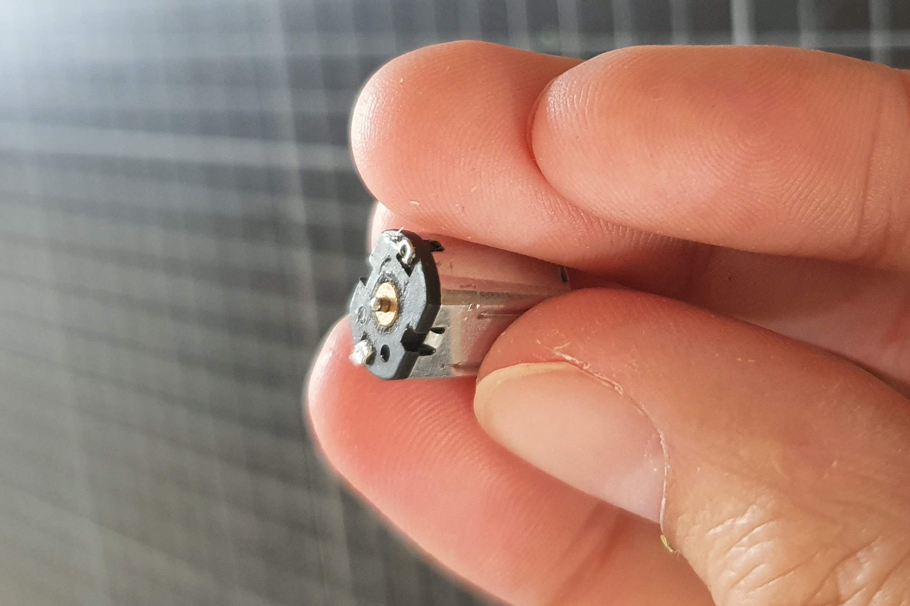 |
| --- | --- | --- |

3) Place one of the holes on a servo horn over the axis. Then use a screw and a vice to push out the motor axis about 1 mm so it looks like the motor in the last image.

| 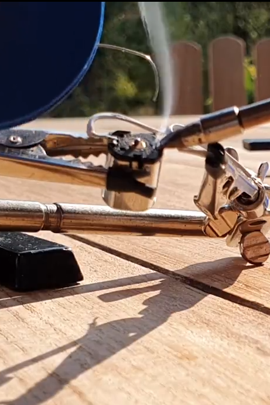 | 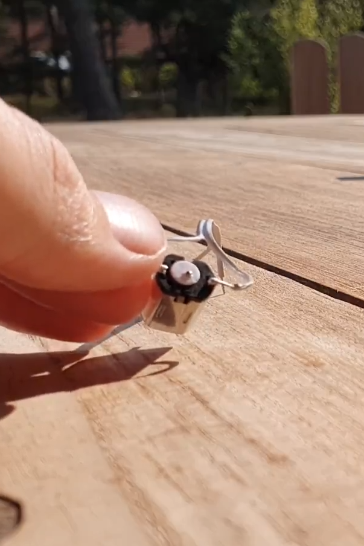 |  |
| --- | --- | --- |

4) Then solder two wires to the motor terminals. Use super glue to mount the optical encoder wheel to the back axis and mount the 3D printed "OpticalEncoderSensorMount" part over the back of the motor.

|  | 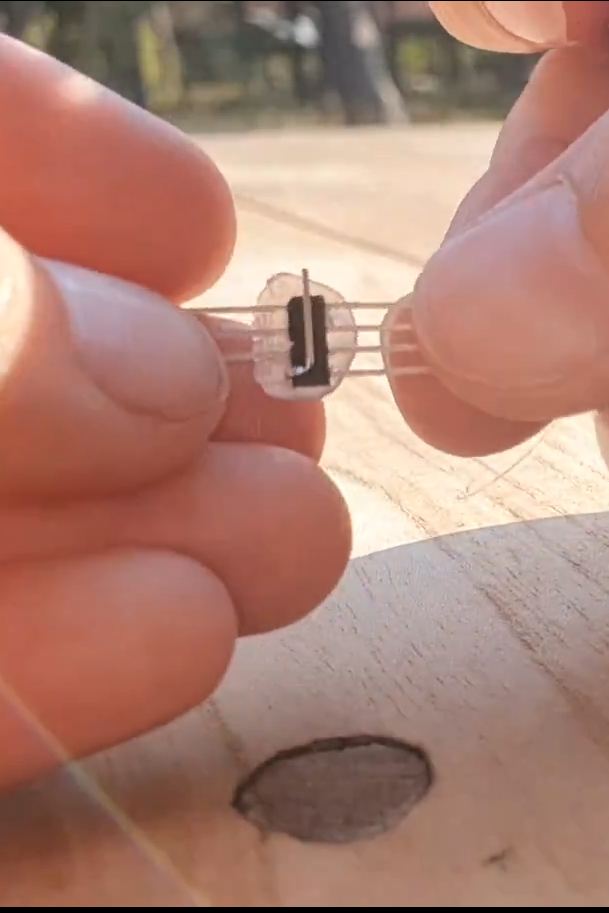 |  |
| --- | --- | --- |

5) Place the two IR sensors next to each other on a piece of tape and put some hot glue over them. Fold pin 4 of the lower sensor like the middle picture shows. Then fold in the rest of the ground pins, cut them to length and solder them together.

| 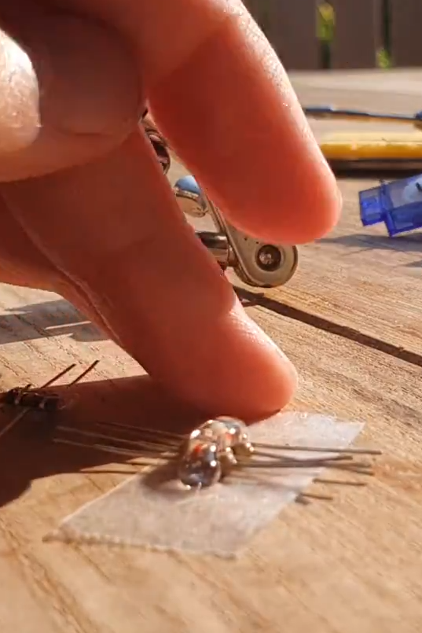 |  | 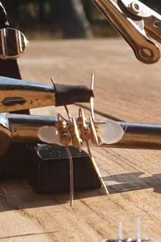 |
| --- | --- | --- |

6) Place the four resistors next to each other on a piece of tape, in the order 6.8k, 120, 1.5k and 120 ohm from right to left. Put some hot glue over them to hold them together and remove the tape. Fold the top leg of the 6.8k resistor like the middle picture shows. Then fold in the rest of the 3.3V pins and solder them together.

|  |  |
| --- | --- |

7) Connect the two 120 ohm resistors to pin 1 on the IR sensors and the 6.8k and 1.5k ohm resistors to pin 3.

|  |
| --- |

8) Solder three wires to the potentiometer.

|  | 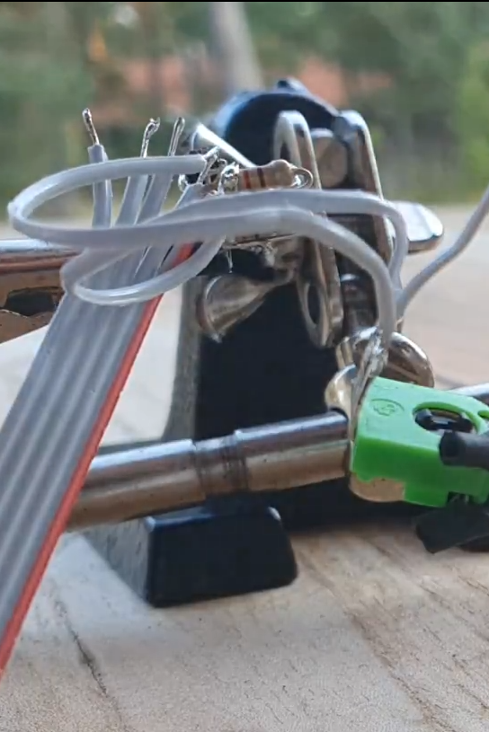 | 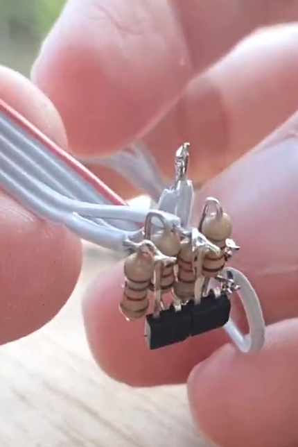 |
| --- | --- | --- |

9) Connect the potentiometers 3.3V and ground to the optical encoder sensors while soldering on a 5 wire flat cable to the assembly. Then connect the third wire of the flat cable to the potentiometer sens wire and connect the fourth and fifth wires to the IR sensors third pin. This wires up the flat cable so that from right to left we have: 3.3V, GND, output shaft potentiometer, optical encoder channel A and lastly channel B.

| 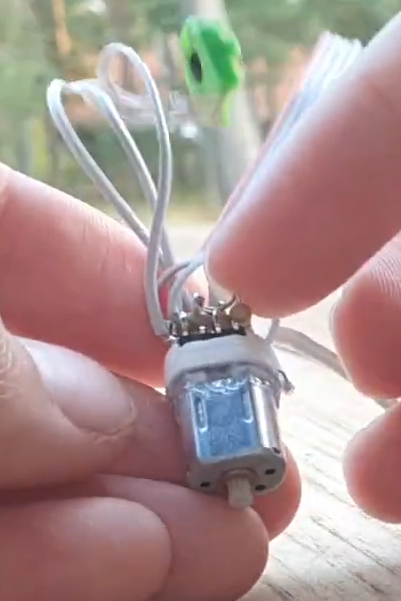 | 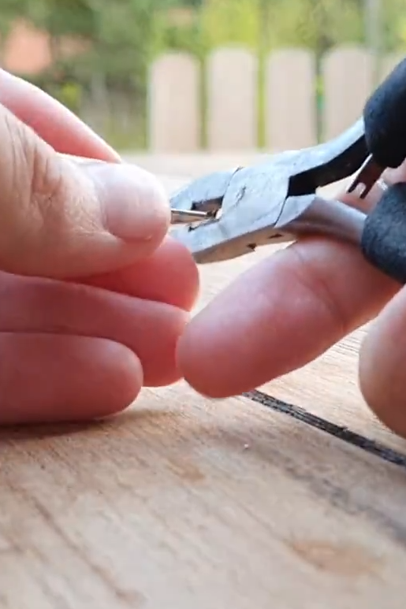 | 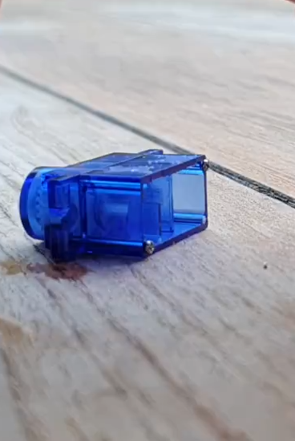 |
| --- | --- | --- |

10) Glue the optical encoder sensors to the "OpticalEncoderSensorMount". Cut the screws to a length so that they fit with the servo lid removed.

| 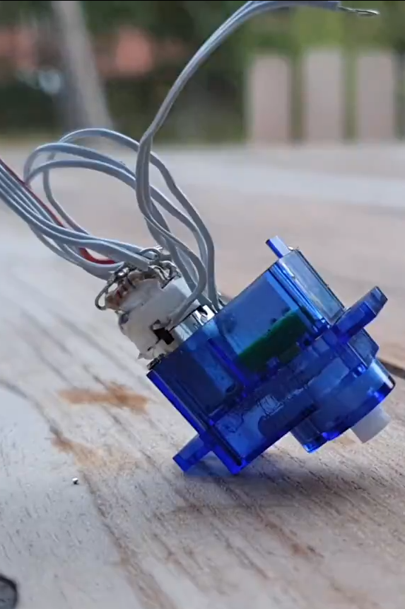 |
| --- |

11) Put back the motor and the potentiometer into the servo. See "PcbDesignes/MicroServo/MainPcb/MainPcb.sch" for info on how to connect the microcontroller and motor driver.

## License
Open Source License

ServoProject is free software. You can redistribute it and/or modify it under the terms of Creative Commons Attribution 3.0 United States License.

To view a copy of this license, visit
http://creativecommons.org/licenses/by/3.0/us/
