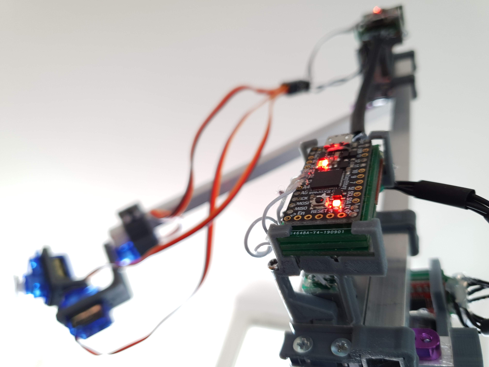
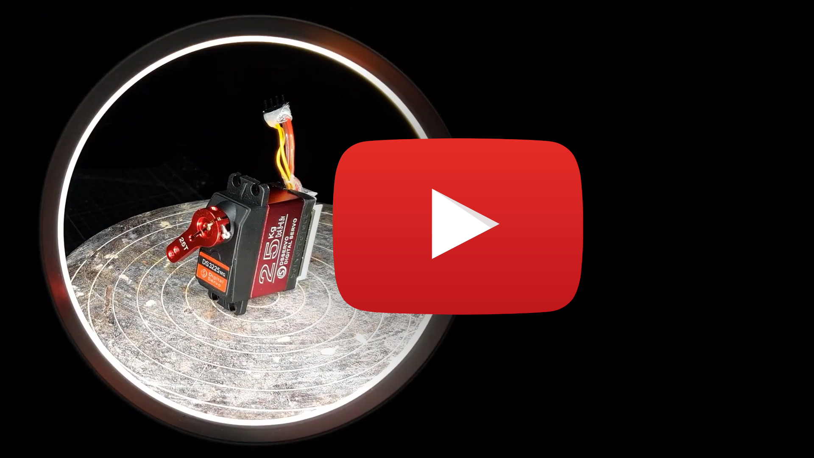
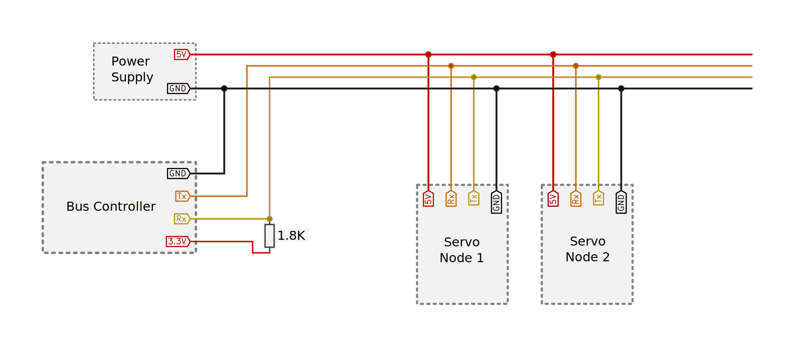

# ServoProject
by Adam Bäckström
### Getting the most out of your hobby servo



Video demo of project
---------------------

[](https://youtu.be/ECLrLupFW10)

Additional documentation for the project
----------------------------------------

[Theory](Doc/Theory.md)

[Dependencies](Doc/Dependencies.md)

#### Build instructions

 * [Brushed servo](Doc/BuildInstructionsBrushedServo.md)

 * [Coreless servo](Doc/BuildInstructionsCorelessServo.md)

 * [Micro servo](Doc/BuildInstructionsMicroServo.md)

 * [Part list for robot and gripper](Doc/PartListForRobotAndGripper.md)


Project structure
----------------

### ArduinoSketch

This folder contains the Arduino project for the Adafruit ItsyBitsy M0 Express boards.

Easiest way to program and configure the servos is through the configurationWizard.py script.
Just run `python3 ./ArduinoSketch/configurationWizard.py` to get started. The script will ask if it should install any missing dependencies.

PLEASE NOTE!
Windows users must use MSYS2 due to the the PyGObject package, see https://pygobject.readthedocs.io/en/latest/getting_started.html. After installing MSYS2 run the script with:
```
C:\msys64\mingw64\bin\python.exe ArduinoSketch\configurationWizard.py
```

#### Manually compiling the Arduino sketch

When compiling, the active configuration is selected by modifying the `#include "*.h"` line in the `config/config.h` file to include the desired config file. The `configSelector.py` script can be used to simplify the config selecting process by giving a drop-down list with all configs in the config folder.

The folder also holds a Makefile which can be used to compile and transfer the project. One benefit of using the Makefile is that the configSelector script is always executed prior to compiling. To be able to use the Makefile you must first install arduino-cli.

```
Arduino sketch dependencies:
  - Adafruit DotStar `source:` Arduino Library List
  - Eigen `source:` Arduino Library List
```

### C++/Demo

Holds a minimal c++ demo project.

To compile run `make`. This creates the program `./executable`
```
Dependencies:
  - GNU Make >= 4.2.1
  - gcc >= 9.3.0
  - boost >= 1.71.0
```

### C++/Example6dofRobot

Holds the example 6dof robot project.

To compile run `make`. This creates the program `./executable` with the following options.

```
Allowed options:
  --playPath            play the path defined in createPath()
  --gui                 open jogging gui
  --output arg          data output file
  --simulate            simulate servos

```
```
Dependencies:
  - GNU Make >= 4.2.1
  - gcc >= 9.3.0
  - boost >= 1.71.0
  - Eigen >= 3.4.0
  - gtkmm-3.0 >= 3.24
```

### C++/Library

Holds the C++ library for communicating with the servos.
```
Dependencies:
  - GNU Make >= 4.2.1
  - gcc >= 9.3.0
  - boost >= 1.71.0
```

### CadFiles

Holds all `.stl` and the original Freecad files

### PcbDesignes

Holds all KiCad projects for the electronics

### Python/Demo

Holds a minimal python demo project.

### Python/ServoProjectModules

Holds all python modules for the project.

Communication bus setup for demo projects
-----------------------------------------

#### ONLY CONNECT THE SERVO TO 3.3V LOGIC!!!!



PLEASE NOTE! The bus controller needs to have a low latency to get fast communication with the servos. Most standard USB to Serial converters buffer the data and only transfers every 10 ms or so. This becomes a problem since the communication protocol will wait for the response from each servo before moving on to the next, adding huge delays.

To get the best communication speed it is recommended to use an "Adafruit ItsyBitsy M0 Express" (or similar ARM based Arduino) as the USB to Serial converter. Just program the Arduino with the `usbToSerial.h` configuration in the ArduinoSketch to get started. In `usbToSerial.h` you can also configure any regular servos you want to control together with the ServoProject modified ones.

How to switch to PWM interface version
--------------------------------------

#### ONLY CONNECT THE SERVO TO 3.3V LOGIC!!!!

Using the PWM interface is not recommended due to low resolution and high noise, but it is possible by modifying the configuration file. To enable PWM control replace the `getCommunicationHandler()` function with the version below.

```
    static std::unique_ptr<Communication> getCommunicationHandler()
    {
        Serial.begin(115200);
        auto com = std::make_unique<Communication>(SerialComOptimizer(&Serial));
        uint8_t pwmPin = 0; // Rx pin, ONLY CONNECT TO 3.3V LOGIC!!!!
        uint8_t controlSpeed = 14;
        uint8_t backlashControlSpeed = 2;
        float scale = 2.0f; // 2 units per us (4096 units == 360 deg)
        float offset = 1024.0f; // move to 1024 units (90 deg) for 1500 us pwm signal
        com->addCommunicationNode(
                std::make_unique<DCServoCommunicationHandlerWithPwmInterface>(1,
                    createDCServo<SetupConfigHolder>(controlSpeed, backlashControlSpeed),
                    pwmPin, scale, offset));
        return com;
    }
```

License
-------

Open Source License

ServoProject is free software. You can redistribute it and/or modify it under the terms of Creative Commons Attribution 3.0 United States License.

To view a copy of this license, visit
http://creativecommons.org/licenses/by/3.0/us/
